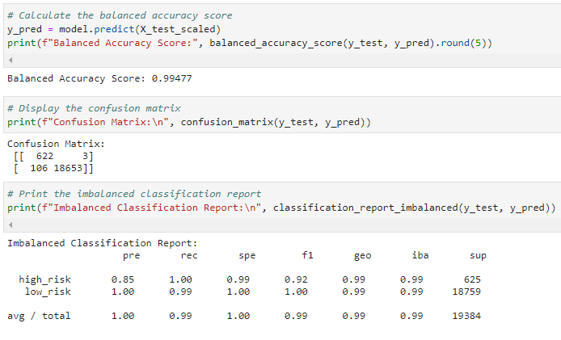
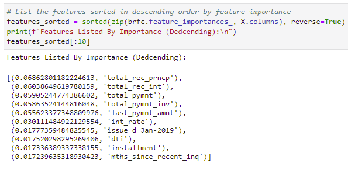

<h1 align="center">Assignment Unit 11 - Risky Business</h1>

    
    <section></section>
    <section> <b>By: Ebad Salehi </b> </section>

  

———————— ≡₪₪₪₪≡■■■■■■■■■■■■■■■■■■≡₪₪₪₪≡ ————————
  
<!-- TABLE OF CONTENTS -->

  
 <b>Table of Contents</b>

  <ul>
        <li><a href="#in-a-nutshell"> In a Nutshell</a> </li>   
        <li><a href="#files">Notebooks</a></li>
        <li><a href="#resampling"> Resampling Steps and Output</a></li>
        <li><a href="#ensemble">Ensemble Learning</a></li>  
        <li><a href="#tech">Technologies Used</a></li>    
  </ul>

———————— ≡₪₪₪₪≡■■■■■■■■■■■■■■■■■■≡₪₪₪₪≡ ————————

 

<h2> In a Nutshell </h2>
In this repo, several <b>Machine Learning models</b> are evaluated against each other to predict 'Credit Risk' using data from peer-to-peer lending services.
Because credit risk is an inherently imbalanced classification problem (the number of good loans is much larger than the number of at-risk loans), hence the employing different training and evaluation models with imbalanced classes. In this assignmnet folowing <i>python libraries</i> are used:

 - `imbalanced-learn`
 - `Scikit-learn` 

 

<h2> Notebooks </h2>
    
There are two notebooks to in `.ipynb` format:
[Resampling Notebook](/credit_risk_resampling.ipynb)
[Ensemble Notebook](/credit_risk_ensemble.ipynb)

 

<h2> Resampling Steps </h2>
 
 - Split the Data into Training and Testing sets
 - Data Pre-Processing
 - Simple Losgistic Regrression
 - Oversampling 
	 - Naive Random Oversampling
	 - SMOTE
 - Undersampling (ClusterCentroids)
 - Combination Sampling (SMOTEEN).

 Snapshot of SMOTEEN Report: 

    
    

 
	
<h3> Resampling Output </h3>

**Balanced Accuracy Scores:**    
> - Simple Logistic Regression: 0.95432
> -   Naive Random Oversampling: 0.80415
> -   SMOTE Oversampling: 0.80415
> -   Undersampling (ClusterCentroids): 0.99008
> -   Combination Sampling (SMOTEEN): 0.99477

**Recall Scores:**
> -   Simple Logistic Regression: 0.99
> -   Naive Random Oversampling: 0.63
> -   SMOTE Oversampling: 0.63
> -   Undersampling (ClusterCentroids): 0.99
> -   Combination Sampling (SMOTEEN): 0.99

**Geometric Mean Scores:**
> -   Simple Logistic Regression: 0.95
> -   Naive Random Oversampling: 0.78
> -   SMOTE Oversampling: 0.78
> -   Undersampling (ClusterCentroids): 0.99
> -   Combination Sampling (SMOTEEN): 0.99

 

<h2> Ensemble Learning </h2>

In this section, we compare two ensemble algorithms `Balanced Random Forest Classifier` and `Easy Ensemble classifier` to determine which algorithm results in the best performance. 
    
**Balanced Accuracy Scores:**
> - Balanced Random Forest Classifier: 0.76373
> - Easy Ensemble Classifier: 0.93166

 Snapshot of Features Listed By Importance: 

  
    
    
  
  

<h3>Ensemble Learning Questions:</h3>
    
1. Which model had the best balanced accuracy score?

    >**Easy Ensemble Classifier Model** has the best balanced accuracy score (*0.93166*) compare to Balanced Random Forest Classifier model (*0.76373*)

2. Which model had the best recall score?

    >**Easy Ensemble Classifier model** had the best (avg/total) recall score (*0.94*) compare to Balanced Random Forest Classifier model at (*0.90*)
3. Which model had the best geometric mean score?

    >**Easy Ensemble Classifier model** had the best (avg/total) geo score (*0.93*) compare to the Balanced Random Forest Classifier model at (*0.75*).

4. What are the top three features?

	 >1. (0.06862801182224613, 'total_rec_prncp')
	 >2. (0.06038649619780159, 'total_rec_int')
	 >3. (0.05905244774386602, 'total_pymnt')

	
<h2> Technologies Used: </h2>
	
   - imbalanced-learn
   - Scikit-learn
   - Pandas
   - Numpy
   - pathlib
   - Counter  
   - Jupyetr notebook

(<a href="#top">↥ back to top</a>)

 
